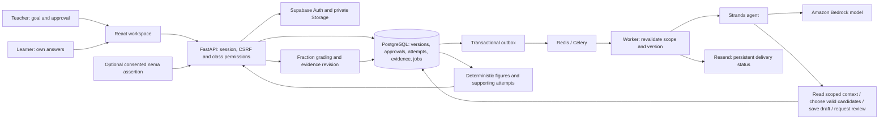

# Tiza architecture

The model cannot approve or publish. The authenticated teacher grants an immutable approval; the publication service and worker validate it before effects. The local preview substitutes SQLite and deterministic planning and labels that substitution. Actual model invocation and tool names are exposed only from persisted run metadata. EC2/Caddy deployment and external providers require account configuration.
