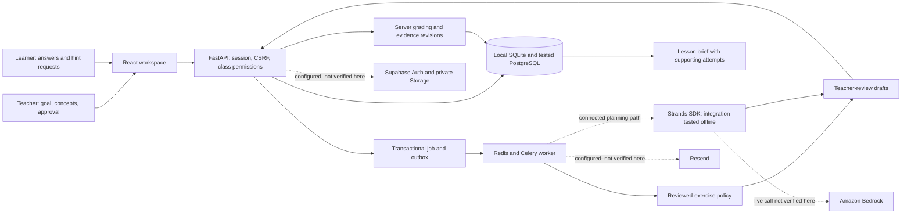

# Tiza architecture

## Verified local path

The local synthetic workflow runs React/Vite, FastAPI, a durable job/outbox path, the reviewed fractions catalog, deterministic planning, version-bound teacher approval, server-side grading and evidence-backed lesson briefs. In `deterministic_demo`, preparation writes `model_invoked=false`; the interface and persisted metadata identify it as a local run. The landing preview is a recording of that synthetic workflow with an illustrative, capture-only tool sequence. Its manifest preserves that no model was invoked.

The teacher authorizes the exact version before publication. The agent path cannot approve, publish, submit learner answers, write grades or execute arbitrary database work. Its scoped tools read cycle context and validated candidates, save bounded draft choices, and request teacher review.

## Deployment and provider path — unverified here

The production configuration is designed to use PostgreSQL, Redis/Celery, Strands with Bedrock, Supabase Auth/private Storage, Resend and HTTPS behind Caddy. Those provider integrations require credentials and an account configuration outside this workspace. They have not been exercised here, so the dashed links in the diagram are architectural integrations, not a claim of a connected run, delivery, deployment or provider audit.

Use [submission.md](submission.md) to run and record a connected cycle. Inspect the persisted agent run rather than inferring a model invocation from UI motion or a local preview.
